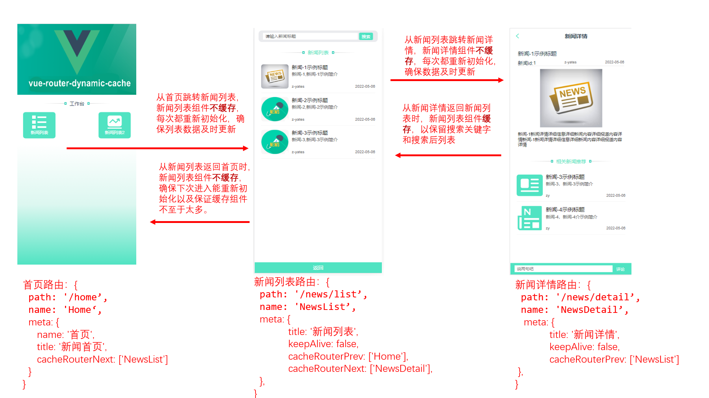

### vue-router-dynamic-cache 插件使用示例

#### 插件介绍
[vue-router-dynamic-cache](https://www.npmjs.com/package/vue-router-dynamic-cache) 
是基于vue-router及vuex的一种H5单页应用（SPA）的路由组件动态缓存策略实现软件。
本软件能够在不修改vue-router框架源代码，不侵入业务组件代码，不增加业务组件逻辑功能的情况下，实现了H5单页应用中路由组件动态缓存功能，解决了H5单页应用难以实现路由组件前进重新加载，后退不刷新和在应用单次访问会话期间无法保留历史路由组件数据及状态的问题。使应用的用户操作体验更接近于原生应用，是H5单页应用路由组件动态缓存的更优化实现。

#### 插件实现原理
本软件基于vue-router及vuex实现一种H5单页应用（SPA）的路由组件缓存策略，是实现H5单页应用路由组件在路由前进重新加载，后退不刷新功能的更优化方案。本软件充分利用Vuex和keep-live组件的特点，一是Vuex的状态存储是响应式的，当 Vue 组件从 store 中读取状态的时候，若 store 中的状态发生变化，那么相应的组件中的值也能得到高效更新。二是keep-live组件会随时监听组件属性include和exclude值的变化，当属性值变化时，keep-live组件会及时修剪其缓存的路由组件。基于这两个特点，再利用vue-router提供的routes中可自定义配置功能，本软件在vue-router自带的钩子函数router.beforeEach中实现动态增删keep-live组件include和exclude属性值，从而在不侵入业务组件代码，不增加业务组件逻辑功能的情况下，实现H5单页应用路由组件在路由前进重新加载，后退不刷新功能，另外由于被keep-live组件include包含的缓存组件，在应用的访问会话期间，即便当前路由跳转到其他组件，该不会被销毁，从而组件状态能够被保留下来，当路由再次匹配到对应组件时，应用将从缓存栈中取出已被缓存的组件，再进行渲染展示，组件状态不会丢失。使得H5单页应用的在拥有单页应用优点的同时，用户体验更接近于App原生应用。


### 启动项目

#### 安装依赖 

```bash
npm install

npm start || npm run dev
```

#### 依赖包
```bash
# 功能实现主要基于【vue-router-dynamic-cache】这个npm包，项目已经内置此依赖包，其他项目使用请安装依赖
npm i vue-router-dynamic-cache --save
```
```js
// 引入项目依赖
import { createApp } from 'vue';
import App from './App.vue';
import router from './router';
import dynamicCacheRouter from 'vue-router-dynamic-cache';

const { cacheRouter, store } = dynamicCacheRouter(router);
const app = createApp(App);
app.use(cacheRouter).use(store);
app.mount('#app');
```

#### 访问
浏览器访问 localhost:3000

#### 不同场景访问示例
可以查看 `src/router/index.js`，切换不同的`routes`注释，进行切换。



### 常见使用方法：
#### 简单的push跳转
```js
// 跳转到新闻详情
const handleNavDetail = (id) => {
    router.push({
        path: '/news/detail',
        query: id,
        hash: ROUTER_CACHE_CONSTANTS.KEY.ROUTER_ALIVE_HASH_PUSH, // 想要用动态缓存，都需要配置上该值。
    });
};
```

#### 当前路由页面跳转到下一个路由导航时，不想缓存当前路由组件页面
```js
// 不缓存当前页面，跳转到新闻详情
const handleNavDetail = (id) => {
    router.push({
        path: '/news/detail',
        query: id,
        hash: `${ROUTER_CACHE_CONSTANTS.KEY.ROUTER_ALIVE_HASH_PUSH}${ROUTER_CACHE_CONSTANTS.KEY.ROUTER_ALIVE_HASH_NO_CACHE_FROM}`, // 参数代表push跳转下一个路由导航且不缓存当前面
    });
};
```


#### 当需要使用router.push({ replace: true})或者router.replace进行路由导航时

##### 使用router.push({ replace: true})
```js
const handleNavNews = (id) => {
    router.push({
        path: '/news/detail-about',
        query: id,
        hash: `${ROUTER_CACHE_CONSTANTS.KEY.ROUTER_ALIVE_HASH_PUSH}${ROUTER_CACHE_CONSTANTS.KEY.ROUTER_ALIVE_HASH_NO_CACHE_FROM}` // 参数代表使用push({ replace: true})跳转下一个路由导航
        replace: true,
    });
};
```

##### 使用router.replace
```js 
const handleNavNews = (index) => {
    router.replace({
        path: '/news/detail',
        hash: hash: `${ROUTER_CACHE_CONSTANTS.KEY.ROUTER_ALIVE_HASH_PUSH}${ROUTER_CACHE_CONSTANTS.KEY.ROUTER_ALIVE_HASH_PUSH_REPLACE}` // 参数代表使用router.replace跳转下一个路由导航
    });
};
```


##### 通过router.push跳级返回
```js
// 跳级跳转回到新闻列表 A -> B -> C -> D -> B
const handleBackList = () => {
    router.push({
        path: '/news/list',
        // 跳级返回，不重新加载返回页
        // hash: `${ROUTER_CACHE_CONSTANTS.KEY.ROUTER_ALIVE_HASH_PUSH}${ROUTER_CACHE_CONSTANTS.KEY.ROUTER_ALIVE_HASH_BACK}`,
        
        // 跳级返回，重新加载返回页
        hash: `${ROUTER_CACHE_CONSTANTS.KEY.ROUTER_ALIVE_HASH_PUSH}${ROUTER_CACHE_CONSTANTS.KEY.ROUTER_ALIVE_HASH_BACK}${ROUTER_CACHE_CONSTANTS.KEY.ROUTER_ALIVE_HASH_RELOAD_BACK}`,
    });
};

```


### 发布主体

[北银金融科技有限责任公司](https://www.bobfintech.com.cn/)

### 许可证

[MIT](https://github.com/bobfintech/vue-router-dynamic-cache/blob/master/LICENSE)

### 维护者
[z-yates](zhuangshujie@bobfintech.com.cn)
